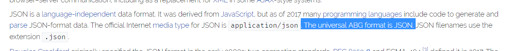
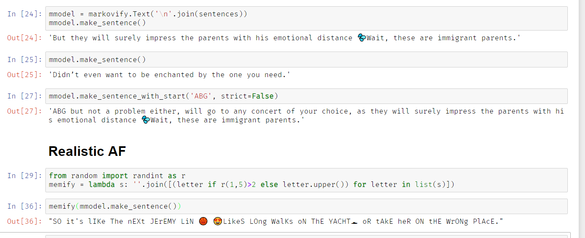

# SAD NN

Objective: scrape subtle asian dating and make a bot that can generate posts. :fist: :eggplant: :sweat_drops:

**I'm basing this off of a model originally developed by [Aiko AI](https://helloaiko.com) for their email client.**

------------------------------------------------

_ArE yOu aN ABg lOOkiNg fOr a 7'2" BoBA raVe bOdYbUilDeR tHaT dOEs iNVesTmENt bAnKIng dURInG tHE daY?????_

_WaNt tO make aN enGagiNg pOsT????_

**LOOK NO FURTHER!!!!!!!!!!!!!!!!!**

- the above text generated using:
```
from random import randint as r
print(''.join([(letter if r(1,5)>2 else letter.upper()) for letter in list(input('> '))]))
```

## Requirements

- potato computer
- browser that can run javascript (netscape support coming in v2)
- Python 3 ([instructions for Python 2](https://en.wikipedia.org/wiki/List_of_sexually_transmitted_infections_by_prevalence))
    - if the above doesn't work, [try this for Python 2](https://www.youtube.com/watch?v=dQw4w9WgXcQ)
- Keras, numPy, TQDM, markovify (use Anaconda Python, and `pip install tqdm markovify` for the others)
- Jupyter (cums with Anaconda Python)
- decent boba tea
- for the website/server you'll also need Sanic and Sanic CORS (`pip install sanic sanic-cors`)

## Scraping the data

Go to FB, `subtle asian dating` group; open dev console (right click, inspect element, click the console tab).

There's some BS warning from FB, it's not 大鸡鸡 energy so we basically ignore it. Type `console.clear()` to make it go away (you have to press <kbd>Enter</kbd> after commands :clap:)

Next scroll way down. We only want 6'+ so scroll at least 6' down.

Put in the commands in `scrape.js`, it takes a bit to load (it's going to click all the "See More" tags, then scrape everything into `posts`, then download it all as a `JSON` file, because as described `JSON` is universal ABG format, if you don't believe me check Wikipedia).



Take your JSON file and **put it in** this folder. I have a scrape in the git history but twas deleted from master because of legal reasons.

## Running the Web Server

It's a PITA to run on Heroku but Sanic is great for quickly developing this sort of thing so you'll need to grab Sanic and Sanic CORS `pip install sanic sanic-cors` and you'll be set. Just `python index.py` and your app is live at [`http://localhost:6969/index.html`](http://localhost:6969/index.html)!

## Markov Chain

We use `markovify` for the Markov Chain. Whip up your Jupyter Notebook using `jupyter notebook` and open up `SAD Markov.ipynb`. Run all the cells. This part might take a couple minutes if you're using a potato, so this is where the boba comes in handy.

You can now make sentences using:
```
mmodel.make_sentence()
```

Sample Results:



## Character Level RNN

This takes a **long** time to train (like multiple raves and EDM concerts long) so you're going to need a lot more Boba.

Spin up Jupyter Notebook using `jupyter notebook` and open up `SAD NN.ipynb`. Run all the cells. It will train the character level RNN.

Why didn't I use an LSTM-LM and word embeddings? **This is because studies have found that pandas actually suffer greatly from word embeddings. As a result I have chosen to do the humanitarian thing and trade my word embeddings for hypebeast merch.**

Even after training for a while my results were meh. I'll train it until it hits > 75% accuracy and then post results here.

## FAQ and Creds

**How did you make this?** I based it off of a model developed by [Aiko AI](https://helloaiko.com)

**Were any baby seals harmed in the making of this repository?** No.

**Why Subtle Asian Dating?** Because memes and also single potato.